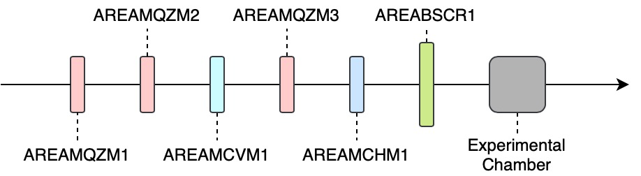

# ARES EA RL

Training and evaluating a reinforcement-learning agent on the quadrupole triplet and two correctors in the ARES experimental area.

## The Problem

We consider the _Experimental Area_ of ARES. Toward the downstream end of the Experimental Area, there is the screen `AREABSCR1` where we would like to achieve a choosable set of beam parameters, the beam position and size in both x- and y-direction. To this end, we can set the values of three quadrupoles `AREAMQZM1`, `AREAMQZM2` and `AREAMQZM3`, as well as two steerers `AREAMCVM1` and `AREAMCHM1`. Below is a simplified overview of the lattice that we consider.



__Note__ that simplified versions of this problem may be considered, where only the quadrupoles are used to achieve a certain beam size, or only the steerers are used to position the beam. Another simplification that may be considered is that the target beam parameters need not be choosable but rather the goal is to achieve the smallest and/or most centred beam possible.

## Finding Your Way Around this Project

The most important part of this project are the environments  which can be found in the `environment` directory.

The file `simulation.py` should be the the entry point to looking at the environments. It contains the class `ARESEACheetah` which defines the logic of our problem and interfaces it with a _Cheetah_ simulation. When we use other backends, such as _Ocelot_ or the machine itself (via _PyDoocs_), these are usually defined as subclasses of `ARESEACheetah`. The Ocelot subclass can be found in `ocelot.py`, the machine subclass in `machine.py`. As a result of this organisation, the logic of our problem is almost exclusively defined in the Cheetah environment, whereas the other environments merely make modifications to the latter where necessary.

Whilst most of the environment are fixed to the problem, some things can be changed as design decisions. These are the action and observation spaces, the reward range, the objective function as well as the way that actions are defined (deltas vs. absolute values). We currently differentiate accelerator spaces from the actual spaces for the purpose or normalisation. All components of the action space and observation space are currently defined to be normalised, i.e. in the range (-1,1). We defined _accelerator spaces_ as the space that is normalised from, i.e. the range given in the accelerator space is expanded or squeezed to the normalised range. For the action space in particular this means that most RL algorithms can only take actions within the ranges defined by the accelerator action space.

To get a sense for how the environments are used for RL training, we recommend a look at `train.py`. What is particularly important is the `FlattenObservation` wrapper. Without it most RL algorithm implementations will not work with the environment.

## A Brief Intro to PyDoocs

We use PyDoocs to communicate with our machines. All writable and readable values have an address, which we call channel. To read a value, one would call

```python
response = pydoocs.read(channel)
value = response["data"]
```

and to write to the machine you run

```python
pydoocs.write(channel, value)
```

We actually created a package `dummy-pydoocs` that allows us to test the interface with PyDoocs without using the real machine.

The package is imported as follows and then used in the code just like PyDoocs itself.

```python
import dummypydoocs as pydoocs
```

These are the DOOCS channels relevant to us:

 - Read screen image: `SINBAD.DIAG/CAMERA/AR.EA.BSC.R.1/IMAGE_EXT_ZMQ``
 - Write magnets settings:
   - `SINBAD.MAGNETS/MAGNET.ML/AREAMQZM1/STRENGTH.SP` (unit 1/m^2)
   - `SINBAD.MAGNETS/MAGNET.ML/AREAMQZM2/STRENGTH.SP` (unit 1/m^2)
   - `SINBAD.MAGNETS/MAGNET.ML/AREAMQZM3/STRENGTH.SP` (unit 1/m^2)
   - `SINBAD.MAGNETS/MAGNET.ML/AREAMCVM1/KICK_MRAD.SP` (unit mrad)
   - `SINBAD.MAGNETS/MAGNET.ML/AREAMCHM1/KICK_MRAD.SP` (unit mrad)
 - Write magnets settings:
   - `SINBAD.MAGNETS/MAGNET.ML/AREAMQZM1/STRENGTH.RBV` (unit 1/m^2)
   - `SINBAD.MAGNETS/MAGNET.ML/AREAMQZM2/STRENGTH.RBV` (unit 1/m^2)
   - `SINBAD.MAGNETS/MAGNET.ML/AREAMQZM3/STRENGTH.RBV` (unit 1/m^2)
   - `SINBAD.MAGNETS/MAGNET.ML/AREAMCVM1/KICK_MRAD.RBV` (unit mrad)
   - `SINBAD.MAGNETS/MAGNET.ML/AREAMCHM1/KICK_MRAD.RBV` (unit mrad)
 - Read and write binning of the screen camera
   - Horizontal: `SINBAD.DIAG/CAMERA/AR.EA.BSC.R.1/BINNINGHORIZONTAL`
   - Vertical: `SINBAD.DIAG/CAMERA/AR.EA.BSC.R.1/BINNINGVERTICAL`

The magnets to take a few seconds to reach the set values. As a result is you may need to wait for them. Furthermore, it may not always be possible to reach a value exactly, which means that waiting for your set value to be reached is not necessarily a good idea. The middle layer server, however, can take care of that for us. Every magnet has a busy flag that is set true while the magnet is changing from one set point to another. The busy flags can be read via these channels:

 - `SINBAD.MAGNETS/MAGNET.ML/AREAMQZM1/BUSY`
 - `SINBAD.MAGNETS/MAGNET.ML/AREAMQZM2/BUSY`
 - `SINBAD.MAGNETS/MAGNET.ML/AREAMQZM3/BUSY`
 - `SINBAD.MAGNETS/MAGNET.ML/AREAMCVM1/BUSY`
 - `SINBAD.MAGNETS/MAGNET.ML/AREAMCHM1/BUSY`

The following code snipped can be used as is to turn the laser on and off.

```python
def switch_cathode_laser(setto):
    """Sets the bool switch of the cathode laser event to setto and waits a second."""
    address = "SINBAD.DIAG/TIMER.CENTRAL/MASTER/EVENT5"
    bits = pydoocs.read(address)["data"]
    bits[0] = 1 if setto else 0
    pydoocs.write(address, bits)
    time.sleep(1)
```
