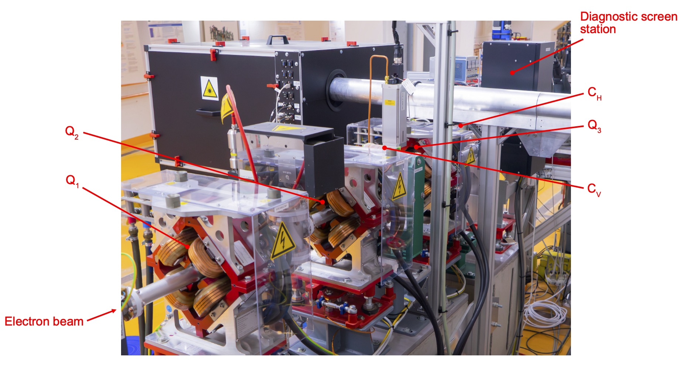
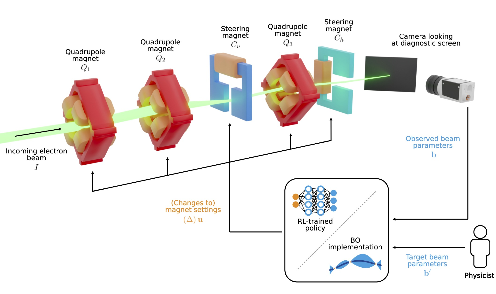

# Overview ARES-EA RL Project

This repository contains the code used to construct the environment and evaluate the Reinforcement-Learning trained optimiser and Bayesian optimiser for the paper _"Learning to Do or Learning While Doing: Reinforcement Learning and Bayesian Optimisation for Online Continuous Tuning"_.

- [Overview ARES-EA RL Project](#overview-ares-ea-rl-project)
  - [The ARES-EA Transverse Beam Tuning Task](#the-ares-ea-transverse-beam-tuning-task)
  - [Repository Structure](#repository-structure)
    - [Evaluation of the results](#evaluation-of-the-results)
  - [The RL/BO control loop](#the-rlbo-control-loop)
  - [Gym Environments](#gym-environments)
    - [Observation](#observation)
    - [Reward definition](#reward-definition)
  - [Installation Guide](#installation-guide)

## The ARES-EA Transverse Beam Tuning Task

We consider the _Experimental Area_ of ARES at DESY, Hamburg. Toward the downstream end of the Experimental Area, there is the screen `AREABSCR1` where we would like to achieve a variable set of beam parameters, consisting of the beam position and size in both x- and y-direction.
To this end, we can set the values of three quadrupoles `AREAMQZM1`, `AREAMQZM2` and `AREAMQZM3`, as well as two steerers (dipole corrector magnets) `AREAMCVM1` and `AREAMCHM1`. Below is a simplified overview of the lattice that we consider.



__Note__ that simplified versions of this problem may be considered, where only the quadrupoles are used to achieve a certain beam size, or only the steerers are used to position the beam. Another simplification that may be considered is that the target beam parameters need not be variable but rather the goal is to achieve the smallest and/or most centred beam possible.

## Repository Structure

Below are the most important scripts

- `environment.py` It contains the Gym environments `TransverseTuningEnv`  and its derived class `EATransverseTuning`.
- `backend.py` contains the different backends that the Gym environments can use to interact with either the simulation model or the real particle accelerator.
- `bayesopt.py` implements a custom Bayesian optimization routine `BayesianOptimizationAgent` acting similar as a RL agent.
- `ea_train.py` An example training script to train a RLO agent. _Note: The RLO agent used in the paper is trained using TD3, the current version uses PPO, which might not fully reproduce the old result._

### Evaluation of the results

- The files `evaluation/eval_*.py` generate the simulation results in different conditions.
- The notebooks `evaluation/eval_*.ipynb` are used to analyse and evaluate the results and generate the final plots.
- `trails.yaml` contains the problem configuration that are used to generate the evaluation results.
- `eval.py` contains utlity functions to load evaluation results and produce plots.

_Note: to run these files, move them out of the evaluation folder to have the correct import path etc._

## The RL/BO control loop



## Gym Environments

The gym environments are built on a base class `TransverseTuningEnv`,which defines a general transverse beam tuning task using a set of magnets as actuators and a screen to for observation, with the goal to position and focus the beam to specified values.
The derived class `EATransverseTuning` desribes the specific task at ARES experimental area (EA).
The `EACheetahBackend` and `EADOOCSBackend` are used to interact with the Cheetah simulation model or the real ARES accelerator.

Whilst most of the environment are fixed to the problem, some things can be changed as design decisions. These are the action and observation spaces, the reward composition (weighting of individual components), the objective function as well as the way that actions are defined (deltas vs. absolute values).

### Observation

The default observation is a dictionary

```python
keys = ["beams","magnets", "target"]
```

After using `FlattenObservation` wrapper, the observation shape becomes `(13,)`, given that no `filter_observation` is used:

- `size= (4,)`, `ind = (0, 1, 2, 3)`, observed beam (mu_x, sigma_x, mu_y, sigma_y) in m
- `size= (5,)`, `ind = (4,5,6,7,8,)`, magnet values $(k_{Q1}, k{Q2}, \theta_{CV}, k_{Q3}, \theta{CH})$ in $1/m^2$ and mrad respectively
- `size= (4,)` ,  `ind = (9,10,11,12)`,  target (mu_x, sigma_x, mu_y, sigma_y) in m

### Reward definition

The reward function of `ARESEA` is defined as a composition of the following parts, each with a configurable weight multiplied

|Components    | Reward   |
|--- |--- |
|beam reward    | +1   |
|--- |--- |
|beam on screen    | +1   |
|x pos in threshold    | +1   |
|y pos in threshold    | +1   |
|x size in threshold    | +1   |
|y size in threshold    | +1   |
|finished    | +1   |
|time steps   | -1   |

The beam distance metric can be chosen to be either L1 (mean aboslute error) or L2 (mean squared error) loss between the current and target beam parameters.

The beam reward mode can be either "_differential_" or "_feedback_". For example for L1 loss:

1. _differential_, or improvement upon last step:  $r = \left(|v_\textrm{previous} - v_\textrm{target}| - |v_\textrm{current} - v_\textrm{target}| \right) / |v_\textrm{initial} - v_\textrm{target}|$, where $v$ are the beam parameters $\mu_x, \mu_y, \sigma_x, \sigma_y$ respectively.
2. _feedback_, or remaining difference target: $r = - |v_\textrm{current} - v_\textrm{target}| / |v_\textrm{initial} - v_\textrm{target}|$

---

## Installation Guide

- Install conda or miniconda
- (Suggested) Create a virtual environment and activate it
- Install dependencies

```sh
conda env create -n ares-ea-rl python=3.9
conda activate ares-ea-rl
pip install -r requirements.txt
```
  